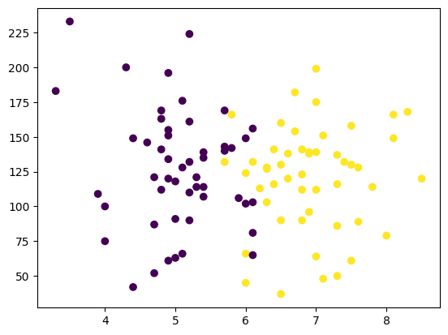
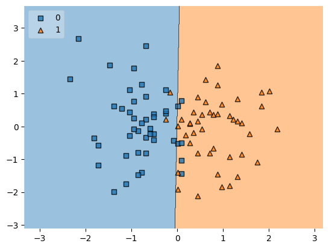

# Student Placement Prediction using Logistic Regression

A machine learning project that predicts whether a student will be placed based on their **CGPA** and **IQ score**.

## Dataset

| Feature | Type | Description |
|---------|------|-------------|
| `cgpa` | float | Student's CGPA |
| `iq` | float | Student's IQ score |
| `placement` | int | 1 = Placed, 0 = Not Placed |

- 100 samples, no missing values

## Project Workflow

1. Load & inspect data
2. EDA — visualize CGPA vs IQ by placement outcome
3. Train-Test Split — 90% train / 10% test
4. Feature Scaling — StandardScaler
5. Model Training — Logistic Regression
6. Evaluation — Accuracy score
7. Decision Boundary visualization
8. Save model using pickle

## Results

| Metric | Value |
|--------|-------|
| Test Accuracy | **100%** |

## Visualizations

**EDA — CGPA vs IQ colored by Placement**



**Decision Boundary (Scaled Features)**



## How to Run

```bash
pip install numpy pandas matplotlib scikit-learn mlxtend
python placement_model.py
```

## Project Structure

```
placement-prediction/
├── placement.csv
├── placement_model.py
├── eda_scatter.png
├── decision_boundary.png
├── model.pkl
└── README.md
```

## Tech Stack

Python | pandas | NumPy | scikit-learn | matplotlib | mlxtend
